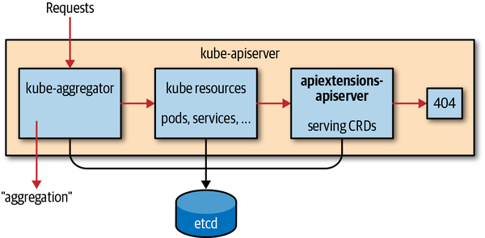

# Custom Reource Definition

## Reource

* A resource is an endpoint int he `kubernetes API` that stores a collection of `API objects`
* `app/v1` is API Endpoint group
* `Deployment` is resource - api object

## Custom Resource

* Customized Resources are `extension` of the kubernetes API
* Resource is which is not available by default
* Once custom resource is created, can access using `kubectl`
* Provides `declarative API`

## Definition

* Declarativecommands to API Server is in the form of YAML construct

## How CRD works?



## Custom Resource Definition (CRD)

* The `CustomResourceDefinition` API resource allows us define custom resourcess
  * Define `CustomResourceDefinition` using YAML
  * Creaete custom Resources using YAML

* Want to make CRDs to work like Pods?
  * Once CRD is created, Create new `Custom Controller` on resource handling create/update/delete events.
  * Build `Custom Controller & deploy` to work CRD as aggregated API for Declarative Resources using kubectl

## Steps to See API Server Groups

```bash
kubectl api-resources | grep -i greeting

kubectl proxy

#to check API group
curl localhost:8001
curl localhost:8001 | grep -i akhilmovva 
```

## Links

`Sample Controller` - <https://github.com/kubernetes/sample-controller>
