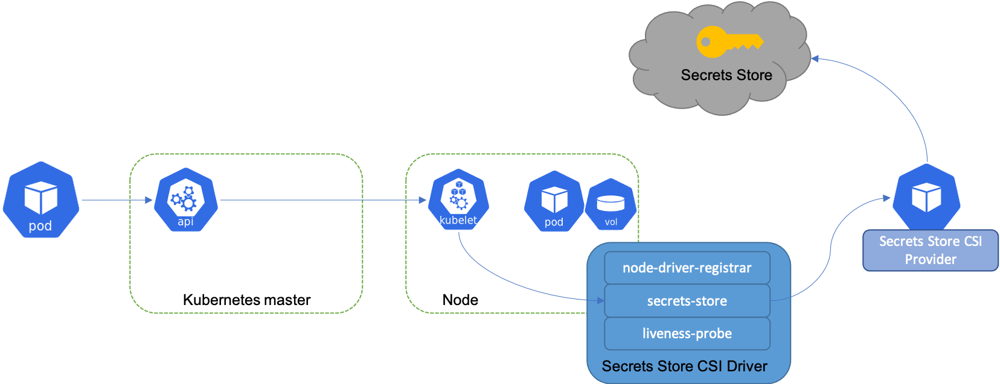

# Secrets Store CSI Driver

## How it works

The diagram below illustrates how Secrets Store CSI volume works:

Similar to Kubernetes secrets, on pod start and restart, the Secrets Store CSI driver communicates with the provider using gRPC to retrieve the secret content from the external Secrets Store specified in the SecretProviderClass custom resource. Then the volume is mounted in the pod as tmpfs and the secret contents are written to the volume.

On pod delete, the corresponding volume is cleaned up and deleted.

## Daemonset

The Secrets Store CSI Driver is a `daemonset` that facilitates communication with every instance of Kubelet. Each driver pod has the following containers:

- `node-driver-registrar`: Responsible for registering the CSI driver with Kubelet so that it knows which unix domain socket to issue the CSI calls on. This sidecar container is provider by the Kubernetes CSI team. See [doc](https://kubernetes-csi.github.io/docs/node-driver-registrar.html) for more details.
- `secrets-store`: Implements the CSI Node service gRPC services described in the CSI specification. It’s responsible for mount/unmount the volumes during pod creation/deletion. This component is developed and maintained in this [repo](https://github.com/kubernetes-sigs/secrets-store-csi-driver).
- `liveness-probe`: Responsible for monitoring the health of the CSI driver and reports to Kubernetes. This enables Kubernetes to automatically detect issues with the driver and restart the pod to try and fix the issue. This sidecar container is provider by the Kubernetes CSI team. See [doc](https://kubernetes-csi.github.io/docs/livenessprobe.html) for more details.

## Provider for the Secrets Store CSI Driver

The CSI driver communicates with the provider using gRPC to fetch the mount contents from external Secrets Store. Refer to [doc](https://secrets-store-csi-driver.sigs.k8s.io/providers.html) for more details on the how to implement a provider for the driver and criteria for supported providers.

Currently supported providers:

- [AWS Provider](https://github.com/aws/secrets-store-csi-driver-provider-aws)
- [Azure Provider](https://azure.github.io/secrets-store-csi-driver-provider-azure/)
- [GCP Provider](https://github.com/GoogleCloudPlatform/secrets-store-csi-driver-provider-gcp)
- [Vault Provider](https://github.com/hashicorp/secrets-store-csi-driver-provider-vault)

## Custom Resource Definitions (CRDs)

### SecretProviderClass

The `SecretProviderClass` is a namespaced resource in Secrets Store CSI Driver that is used to provide driver configurations and provider-specific parameters to the CSI driver.

`SecretProviderClass` custom resource should have the following components:

```yaml
apiVersion: secrets-store.csi.x-k8s.io/v1
kind: SecretProviderClass
metadata:
  name: my-provider
spec:
  provider: vault                             # accepted provider options: azure or vault or gcp
  parameters:                                 # provider-specific parameters
```

Here is an example of a `SecretProviderClass` resource:

```yaml
apiVersion: secrets-store.csi.x-k8s.io/v1alpha1
kind: SecretProviderClass
metadata:
  name: my-provider
  namespace: default
spec:
  provider: aws
  parameters:
    usePodIdentity: "false"
    useManagedIdentity: "false"
    keyvaultName: "$KEYVAULT_NAME"
    objects: |
      array:
        - |
          objectName: $SECRET_NAME
          objectType: secret
          objectVersion: $SECRET_VERSION
        - |
          objectName: $KEY_NAME
          objectType: key
          objectVersion: $KEY_VERSION
    tenantId: "$TENANT_ID"
```

Reference the SecretProviderClass in the pod volumes when using the CSI driver:

```yaml
volumes:
  - name: secrets-store-inline
    csi:
      driver: secrets-store.csi.k8s.io
      readOnly: true
      volumeAttributes:
        secretProviderClass: "my-provider"
```

> NOTE: The SecretProviderClass needs to be created in the same namespace as the pod.

## SecretProviderClassPodStatus

The `SecretProviderClassPodStatus` is a namespaced CRD in Secrets Store CSI Driver that is created by the CSI driver to track the binding between a pod and SecretProviderClass. The SecretProviderClassPodStatus contains details about the current object versions that have been loaded in the pod mount.

Here is an example of a `SecretProviderClassPodStatus` resource:

```yaml
apiVersion: apiextensions.k8s.io/v1
kind: CustomResourceDefinition
metadata:
  annotations:
    controller-gen.kubebuilder.io/version: v0.4.0
  creationTimestamp: null
  name: secretproviderclasspodstatuses.secrets-store.csi.x-k8s.io
spec:
  group: secrets-store.csi.x-k8s.io
  names:
    kind: SecretProviderClassPodStatus
    listKind: SecretProviderClassPodStatusList
    plural: secretproviderclasspodstatuses
    singular: secretproviderclasspodstatus
  scope: Namespaced
  versions:
  - name: v1alpha1
    schema:
      openAPIV3Schema:
        description: SecretProviderClassPodStatus is the Schema for the secretproviderclassespodstatus API
        properties:
          apiVersion:
            description: 'APIVersion defines the versioned schema of this representation of an object. Servers should convert recognized schemas to the latest internal value, and may reject unrecognized values. More info: https://git.k8s.io/community/contributors/devel/sig-architecture/api-conventions.md#resources'
            type: string
          kind:
            description: 'Kind is a string value representing the REST resource this object represents. Servers may infer this from the endpoint the client submits requests to. Cannot be updated. In CamelCase. More info: https://git.k8s.io/community/contributors/devel/sig-architecture/api-conventions.md#types-kinds'
            type: string
          metadata:
            type: object
          status:
            description: SecretProviderClassPodStatusStatus defines the observed state of SecretProviderClassPodStatus
            properties:
              mounted:
                type: boolean
              objects:
                items:
                  description: SecretProviderClassObject defines the object fetched from external secrets store
                  properties:
                    id:
                      type: string
                    version:
                      type: string
                  type: object
                type: array
              podName:
                type: string
              secretProviderClassName:
                type: string
              targetPath:
                type: string
            type: object
        type: object
    served: true
    storage: true
```

## Service Account

Creating a service account in the kube-system

```yaml
---
apiVersion: v1
kind: ServiceAccount
metadata:
  name: secrets-store-csi-driver
  namespace: kube-system
```

## Cluster Role and Role Binging

Create a cluster role to manage resources like events, pods, secretproviderclasses etc. and bind the cluster role with service account
